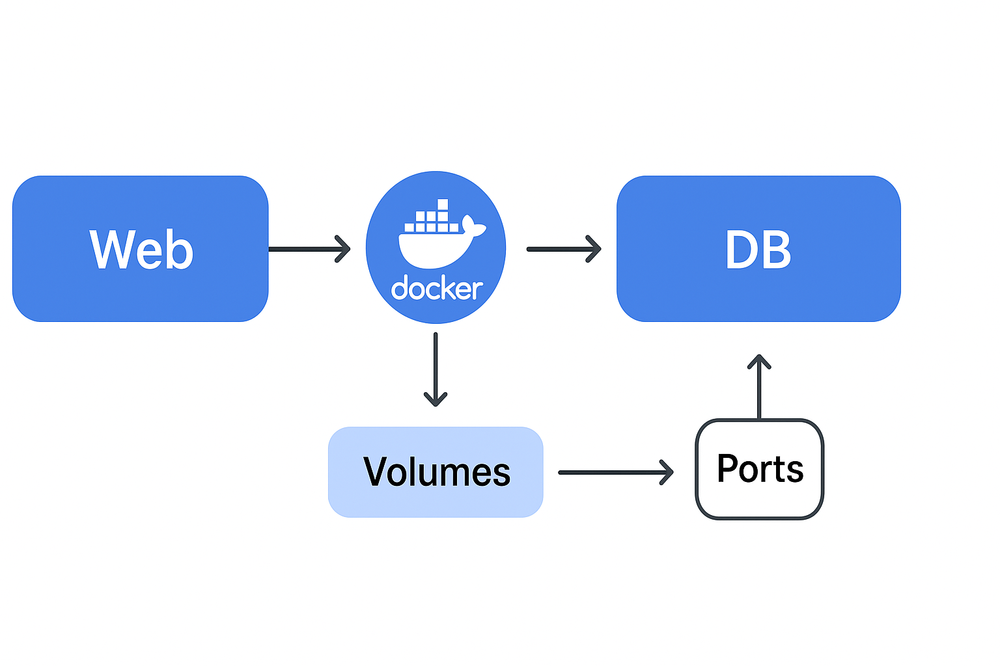

# Buyify

Buyify is a modern e-commerce backend built with **Django** and **PostgreSQL**, containerized using **Docker** for development and production environments.

---

## Table of Contents

- [Features](#features)  
- [Prerequisites](#prerequisites)  
- [Getting Started](#getting-started)  
  - [Development](#development)  
  - [Production](#production)  
- [Docker Makefile](#docker-makefile)  
- [Environment Variables](#environment-variables)  
- [Running Tests](#running-tests)  
- [Contributing](#contributing)  
- [License](#license)  

---

## Features

- User authentication & management  
- Product catalog with CRUD functionality  
- PostgreSQL database integration  
- Dockerized environment for easy setup and deployment  
- Ready for CI/CD pipelines  

---

## Prerequisites

- [Docker](https://www.docker.com/get-started) >= 20.10  
- [Docker Compose](https://docs.docker.com/compose/) >= 2.0  
- Python 3.11 (optional, for local development)  

---

## Getting Started

Clone the repository:

```bash
git clone https://github.com/<your-username>/buyify.git
cd buyify/backend
```

## Development:
- Copy .env.example to .env and update the environment variables:
    ```bash
    cp .env.example .env
    ```

- Build and start development containers:
    ```bash
    make build
    make up
    ```
- Run migrations:
    ```bash
    make migrate
    ```
- Access Django shell:
    ```bash
    make shell
    ```
- View container logs:
    ```bash
    make logs
    ```
- Stop and remove containers and volumes:
    ```bash
    make down
    ```

## Production:
- Ensure docker-compose.prod.yml exists with production configuration.
- Use the Makefile to deploy:
    ```bash
    make prod-deploy
    ```
### This command will:
- Build production images
- Run Django migrations
- Collect static files
- Start the production containers

##

### Docker Makefile
A makefile is included to simplify common Docker operations:
| Command               | Description                            |
| --------------------- | -------------------------------------- |
| `make build`          | Build Docker images without cache      |
| `make up`             | Start dev containers                   |
| `make down`           | Stop dev containers and remove volumes |
| `make migrate`        | Run Django migrations                  |
| `make makemigrations` | Create Django migrations               |
| `make shell`          | Open Django shell                      |
| `make logs`           | View container logs                    |
| `make clean`          | Remove orphan containers and volumes   |
| `make prod-deploy`    | Full production deploy                 |

## 


### Environment Variables
The following variables are required in .env:

```bash
DEBUG=1
SECRET_KEY=<your-secret-key>
POSTGRES_USER=<db-user>
POSTGRES_PASSWORD=<db-password>
POSTGRES_DB=<db-name>
DB_HOST=db
DB_PORT=5432
```
##

### Running Tests
Add your test commands here. For example:
```bash
docker compose run --rm web python manage.py test
```

##

### Contributing
- Fork the repository
- Create a feature branch: git checkout -b feature/my-feature
- Commit your changes: git commit -m 'Add some feature'
- Push to the branch: git push origin feature/my-feature
- Open a pull request


##

### License
This project is licensed under the MIT License. See the LICENSE
 file for details.




